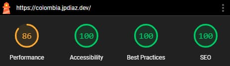

# Colombia 360

### Uncover Colombia's rich tapestry in one platform

Explore Colombia comprehensively with [**Colombia 360**](https://colombia.jpdiaz.dev), a web application designed for in-depth learning _in Spanish_. Dive into national information, departmental details, interactive maps, gastronomic culture, and much more, all in one user-friendly platform.

**Colombia 360** is a comprehensive web application that offers detailed exploration of departments, regions, cities, presidents, tourism, gastronomy, and biodiversity. Its responsive design ensures seamless access across all devices.

Read this document in [Español](/readme_es.md)

<div align="center">

[](https://colombia.jpdiaz.dev/)
[](https://clombia.netlify.app/)
[](https://github.com/JuanPabloDiaz/colombia)


</div>

<a href="https://colombia.jpdiaz.dev"></a>

## ✨ Key Features

### 🗺️ **Interactive Maps**

- **Tourist Map**: Discover must-see destinations with precise locations
- **Departmental Maps**: Detailed visualization of each region
- **Intuitive Navigation**: Explore Colombia visually and interactively

### 🏛️ **Institutional Information**

- **Presidents**: Complete history of Colombian presidents
- **Constitution**: Access to the country's legal foundations
- **Holidays**: Official calendar of non-working days

### 🌍 **Geography and Regions**

- **Departments**: Detailed information on the 32 territorial divisions
- **Cities**: Complete data on major urban centers
- **Regions**: Characteristics of each geographical zone

### 🎭 **Culture and Traditions**

- **Typical Dishes**: Traditional gastronomy by regions
- **Fairs and Festivals**: Cultural calendar and celebrations
- **Indigenous Communities**: Ethnic and cultural diversity

### 🎵 **Media and Entertainment**

- **Radio**: Local and national radio stations
- **Multimedia Content**: Enriched audiovisual experience

### 🌿 **Biodiversity**

- **Invasive Species**: Scientific and conservation information
- **Ecosystems**: Natural richness of the territory

### ✈️ **Infrastructure**

- **Airports**: National air connectivity network

## 🛠️ Tech Stack

This project was built using modern technologies:


### 🚀 Lighthouse Score



## 🗺️ Available Routes

The application includes the following sections:

- `/presidentes` - Presidential history of Colombia
- `/turismo` - Interactive tourist map
- `/mapas` - Collection of country maps
- `/mapa-turistico` - Featured tourist destinations
- `/departamentos` - Departmental information
- `/radio` - Colombian radio stations
- `/especies-invasoras` - Biodiversity and conservation
- `/comunidades-indigenas` - Ethnic diversity
- `/aeropuertos` - Airport infrastructure
- `/platos-tipicos` - Traditional gastronomy
- `/ferias-y-festivales` - Cultural calendar
- `/regiones` - Regional geography
- `/ciudades` - Major cities
- `/constitucion` - Country's legal framework
- `/festivos` - Official calendar

## 🤝 Contribution

Everyone is welcome to collaborate with this project. Before contributing, please read the [contribution guide](CONTRIBUTING.md).

### Contributors

<a href="https://github.com/JuanPabloDiaz/colombia/graphs/contributors"></a>

## 🛠️ Get Started

To get started with [colombia 360](https://colombia.jpdiaz.dev), simply clone the repository and follow the setup instructions. You'll be up and running in no time!

### Setup 📋

1. Clone the repository

   ```bash
   git clone https://github.com/JuanPabloDiaz/colombia.git
   ```

2. Install dependencies

   ```bash
   npm install
   ```

3. Start the development server

   ```bash
   npm run dev
   ```

4. Open [http://localhost:3000/](http://localhost:3000/) with your browser to see the result.

## 🧰 Useful Commands

- Run before Deploy: `npm run build`
- Check for Next.js errors: `npm run lint`
- Format code: `npm run format`
- Clean: `npm run clean`
- Run Lighthouse locally: `npm run lighthouse`
- Preview on Cloudflare: `npm run preview:cloudflare`
- Deploy on Cloudflare: `npm run deploy:cloudflare`

## 🗂️ Related Projects

### Independent Tourist Map

- 🌐 **Demo**: [juanpablodiaz.github.io/turismo](https://juanpablodiaz.github.io/turismo)
- 💻 **Code**: [github.com/JuanPabloDiaz/turismo](https://github.com/JuanPabloDiaz/turismo)
- 🛠️ **Technology**: Jekyll + GitHub Pages
- 📍 **Functionality**: Interactive map of Colombian tourist places

## 📜 License

[Colombia 360](https://colombia.jpdiaz.dev) is licensed under the MIT License.

## 📚 Acknowledgments

Resource list that I find helpful and would like to give credit to:

- The invaluable data used in this project was graciously provided by [**API-Colombia**](https://api-colombia.com/) and [**Miguel Teheran**](https://mteheran.dev/). We extend our sincere gratitude for their contribution.

[](https://nextjs.org/)
[](https://tailwindcss.com/)

*You can deploy this project using the following services:*

[](https://vercel.com/)
[](https://netlify.com/)
[](https://cloudflare.com/)
- [video: deploy nextjs on cloudflare pages](https://www.youtube.com/watch?v=A49jpNN4omY)
- [Deploy nextjs on cloudflare workers](https://developers.cloudflare.com/workers/framework-guides/web-apps/nextjs/#deploy-an-existing-nextjs-project-on-workers)(recommended)
- 


### 🔥 Cool Projects using API-Colombia:

✔️ [Especies Invasoras](https://especiesinvasoras.api-colombia.com/) - React.js portal to find INVASIVE SPECIES in Colombia. ⚡️ [GitHub Repo](https://github.com/Mteheran/invasivespecie-colombia)

✔️ [Colombia-info](https://colombia-info.vercel.app) - OS project to display information about the wonderful country that is Colombia. ⚡️ [GitHub Repo](https://github.com/DavidCast27/colombia-info)

✔️ [Colombian Map - Landing page](https://colombia-rosy.vercel.app/) ⚡️ [GitHub Repo](https://github.com/Orloxx23/7-Landings/tree/main/DIA3)

✔️ [Buscador-ApiColombia](https://github.com/Rinaplata/Buscador-ApiColombia) ⚡️ [GitHub Repo](https://github.com/Rinaplata/Buscador-ApiColombia)

✔️ [DashboardJuridica](https://dashboard-juridica.vercel.app/) ⚡️ [GitHub Repo](https://github.com/RodrigoA15/DashboardJuridica?tab=coc-ov-file)

---

<div align="center">

**🇨🇴 Made with ❤️ for Colombia 🇨🇴**

[⬆️ Back to top](#colombia-360)

</div>
