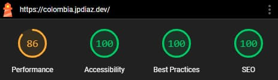

# Colombia 360

### Descubre la riqueza de Colombia en una sola plataforma

Explora Colombia de manera integral con [**Colombia 360**](https://colombia.jpdiaz.dev), una aplicación web diseñada para el aprendizaje profundo _en español_. Sumérgete en información nacional, detalles departamentales, mapas interactivos, cultura gastronómica, y mucho más, todo en una plataforma fácil de usar.

**Colombia 360** es una aplicación web completa que ofrece exploración detallada de departamentos, regiones, ciudades, presidentes, turismo, gastronomía y biodiversidad. Su diseño responsive garantiza acceso perfecto desde cualquier dispositivo.

Lee este documento en [English](/readme.md)

<div align="center">

[](https://colombia.jpdiaz.dev/)
[](https://github.com/JuanPabloDiaz/colombia)

</div>

<a href="https://colombia.jpdiaz.dev"></a>

## ✨ Características Principales

### 🗺️ **Mapas Interactivos**

- **Mapa Turístico**: Descubre destinos imperdibles con ubicaciones precisas
- **Mapas Departamentales**: Visualización detallada de cada región
- **Navegación Intuitiva**: Explora Colombia de forma visual e interactiva

### 🏛️ **Información Institucional**

- **Presidentes**: Historia completa de los mandatarios colombianos
- **Constitución**: Acceso a los fundamentos legales del país
- **Festivos**: Calendario oficial de días no laborales

### 🌍 **Geografía y Regiones**

- **Departamentos**: Información detallada de las 32 divisiones territoriales
- **Ciudades**: Datos completos de las principales urbes
- **Regiones**: Características de cada zona geográfica

### 🎭 **Cultura y Tradiciones**

- **Platos Típicos**: Gastronomía tradicional por regiones
- **Ferias y Festivales**: Calendario cultural y celebraciones
- **Comunidades Indígenas**: Diversidad étnica y cultural

### 🎵 **Medios y Entretenimiento**

- **Radio**: Emisoras locales y nacionales
- **Contenido Multimedia**: Experiencia audiovisual enriquecida

### 🌿 **Biodiversidad**

- **Especies Invasoras**: Información científica y de conservación
- **Ecosistemas**: Riqueza natural del territorio

### ✈️ **Infraestructura**

- **Aeropuertos**: Red de conectividad aérea nacional

## 🛠️ Stack Tecnológico

Este proyecto fue construido utilizando tecnologías modernas:


### 🚀 Puntuación Lighthouse



### Vista de escritorio 🖥️

<a href="https://colombia.jpdiaz.dev">

</a>

### Vista de iPad 📱

<a href="https://colombia.jpdiaz.dev">

</a>

### Vista móvil 📱

<a href="https://colombia.jpdiaz.dev">

</a>

## 🗺️ Rutas Disponibles

La aplicación incluye las siguientes secciones:

- `/presidentes` - Historia presidencial de Colombia
- `/turismo` - Mapa turístico interactivo
- `/mapas` - Colección de mapas del país
- `/mapa-turistico` - Destinos turísticos destacados
- `/departamentos` - Información departamental
- `/radio` - Emisoras de radio colombianas
- `/especies-invasoras` - Biodiversidad y conservación
- `/comunidades-indigenas` - Diversidad étnica
- `/aeropuertos` - Infraestructura aeroportuaria
- `/platos-tipicos` - Gastronomía tradicional
- `/ferias-y-festivales` - Calendario cultural
- `/regiones` - Geografía regional
- `/ciudades` - Principales ciudades
- `/constitucion` - Marco legal del país
- `/festivos` - Calendario oficial

## 🤝 Contribución

Todos son bienvenidos a colaborar con este proyecto. Antes de contribuir, por favor lee la [guía de contribución](CONTRIBUTING.md).

### Colaboradores

<a href="https://github.com/JuanPabloDiaz/colombia/graphs/contributors"></a>

## 🛠️ Comenzar

Para comenzar con [colombia 360](https://colombia.jpdiaz.dev), simplemente clona el repositorio y sigue las instrucciones de configuración. ¡Estarás funcionando en poco tiempo!

### Configuración 📋

1. Clona el repositorio

   ```bash
   git clone https://github.com/JuanPabloDiaz/colombia.git
   ```

2. Instala las dependencias

   ```bash
   npm install
   ```

3. Inicia el servidor de desarrollo

   ```bash
   npm run dev
   ```

4. Abre [http://localhost:3000/](http://localhost:3000/) en tu navegador para ver el resultado.

## 🧰 Comandos Útiles

- Ejecutar antes del deploy: `npm run build`
- Verificar errores de Next.js: `npm run lint`
- Formatear código: `npm run format`
- Ejecutar Lighthouse localmente: `npm run lighthouse`

## 🗂️ Proyectos Relacionados

### Mapa Turístico Independiente

- 🌐 **Demo**: [juanpablodiaz.github.io/turismo](https://juanpablodiaz.github.io/turismo)
- 💻 **Código**: [github.com/JuanPabloDiaz/turismo](https://github.com/JuanPabloDiaz/turismo)
- 🛠️ **Tecnología**: Jekyll + GitHub Pages
- 📍 **Funcionalidad**: Mapa interactivo de lugares turísticos colombianos

## 📜 Licencia

[Colombia 360](https://colombia.jpdiaz.dev) está licenciado bajo la Licencia MIT.

## 📚 Agradecimientos

Lista de recursos que encuentro útiles y a los que me gustaría dar crédito:

- Los valiosos datos utilizados en este proyecto fueron gentilmente proporcionados por [**API-Colombia**](https://api-colombia.com/) y [**Miguel Teheran**](https://mteheran.dev/). Extendemos nuestro sincero agradecimiento por su contribución.

[](https://nextjs.org/)
[](https://tailwindcss.com/)
[](https://vercel.com/)

### 🔥 Proyectos Geniales usando API-Colombia:

✔️ [Especies Invasoras](https://especiesinvasoras.api-colombia.com/) - Portal en React.js para encontrar especies invasoras en Colombia. ⚡️ [GitHub Repo](https://github.com/Mteheran/invasivespecie-colombia)

✔️ [Colombia-info](https://colombia-info.vercel.app) - Proyecto OS para mostrar información sobre Colombia. ⚡️ [GitHub Repo](https://github.com/DavidCast27/colombia-info)

✔️ [Colombian Map - Landing page](https://colombia-rosy.vercel.app/) ⚡️ [GitHub Repo](https://github.com/Orloxx23/7-Landings/tree/main/DIA3)

✔️ [Buscador-ApiColombia](https://github.com/Rinaplata/Buscador-ApiColombia) ⚡️ [GitHub Repo](https://github.com/Rinaplata/Buscador-ApiColombia)

✔️ [DashboardJuridica](https://dashboard-juridica.vercel.app/) ⚡️ [GitHub Repo](https://github.com/RodrigoA15/DashboardJuridica?tab=coc-ov-file)

---

<div align="center">

**🇨🇴 Hecho con ❤️ para Colombia 🇨🇴**

[⬆️ Volver arriba](#colombia-360)

</div>
